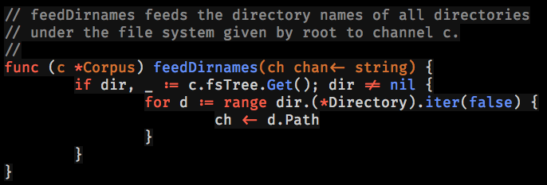

# vim-gitgo

gitgo is a Vim syntax colorscheme, primarily for use with Go. It's inspired by the default GitHub theme for Go syntax, which is pleasantly minimalist and easy on the eye, but `vim-gitgo` uses a dark background instead of light.

It looks like this:



## Installation

With Pathogen:

```sh
cd ~/.vim/bundle
git clone git@github.com:bitfield/vim-gitgo.git
```

## Usage

In your `~/.vimrc`:

```vim
autocmd BufNewFile,BufRead *.go colorscheme gitgo
```

## Requirements

You need a 256-color-capable terminal type, such as:

```sh
export TERM=xterm-256color
```

(If you use iTerm2, set your terminal type to `xterm-256color` in Preferences->Profiles->Terminal->Report Terminal Type.)
