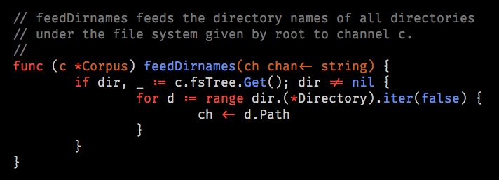
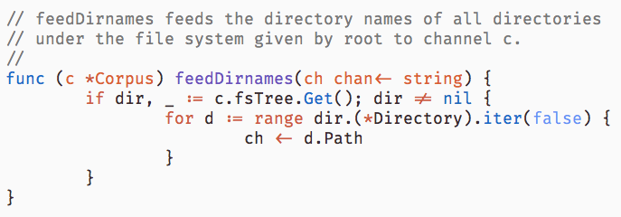

# vim-gitgo

gitgo is a Vim syntax colorscheme, primarily for use with Go. It's inspired by the default GitHub theme for Go syntax, which is pleasantly minimalist and easy on the eye. It's usable both with light and dark backgrounds.

It looks like this in the terminal:



And like this in a graphical Vim:



(The font in the screenshots is [Fira Code Light](https://github.com/tonsky/FiraCode), with ligatures enabled.)

## Installation

With Pathogen:

```sh
cd ~/.vim/bundle
git clone git@github.com:bitfield/vim-gitgo.git
```

## Usage

In your `~/.vimrc`:

```vim
autocmd BufNewFile,BufRead *.go colorscheme gitgo
```

## Requirements

If you're using Vim in a terminal, you need a 256-color-capable terminal type, such as:

```sh
export TERM=xterm-256color
```

(If you use iTerm2, set your terminal type to `xterm-256color` in Preferences->Profiles->Terminal->Report Terminal Type.)
